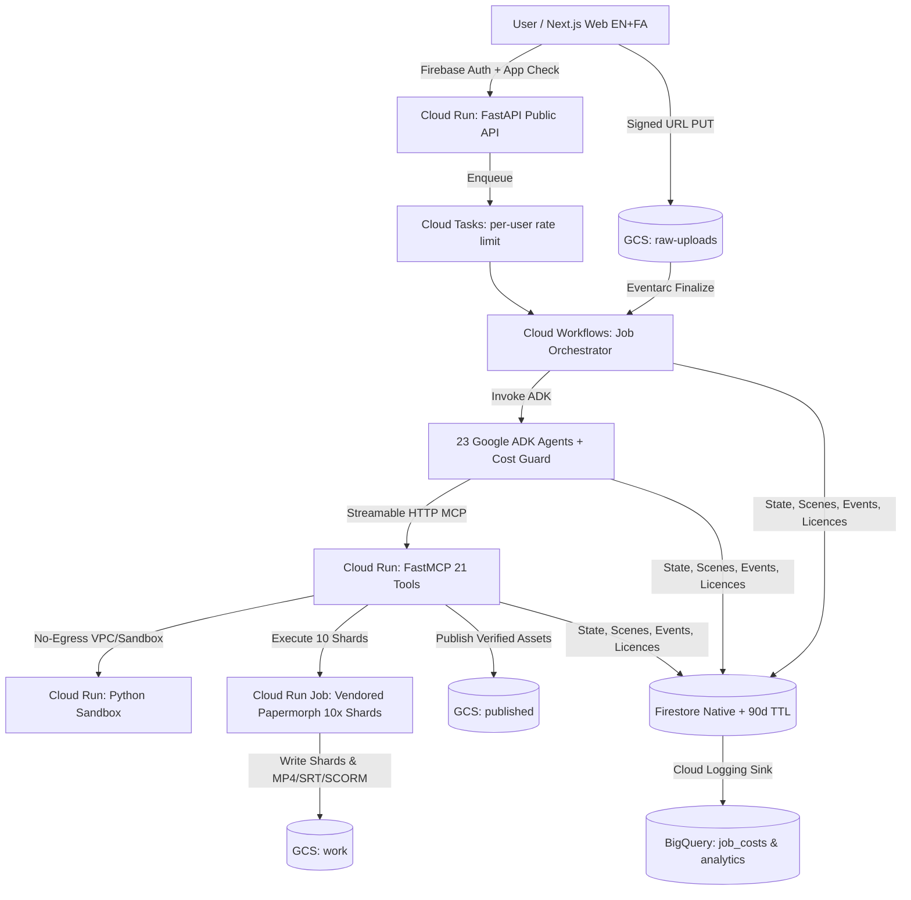

# System Architecture

```mermaid
graph TD
  User[User / Next.js Web EN+FA] -->|Firebase Auth + App Check| API[Cloud Run: FastAPI Public API]
  User -->|Signed URL PUT| RawGCS[(GCS: raw-uploads)]
  RawGCS -->|Eventarc Finalize| WF[Cloud Workflows: Job Orchestrator]
  API -->|Enqueue| Tasks[Cloud Tasks: per-user rate limit]
  Tasks --> WF
  WF -->|Invoke ADK| Agents[23 Google ADK Agents + Cost Guard]
  Agents -->|Streamable HTTP MCP| MCP[Cloud Run: FastMCP 21 Tools]
  MCP -->|No-Egress VPC/Sandbox| Sandbox[Cloud Run: Python Sandbox]
  MCP -->|Execute 10 Shards| RenderJob[Cloud Run Job: Vendored Papermorph 10x Shards]
  RenderJob -->|Write Shards & MP4/SRT/SCORM| WorkGCS[(GCS: work)]
  MCP -->|Publish Verified Assets| PubGCS[(GCS: published)]
  Agents & MCP & WF -->|State, Scenes, Events, Licences| FS[(Firestore Native + 90d TTL)]
  FS -->|Cloud Logging Sink| BQ[(BigQuery: job_costs & analytics)]
```
